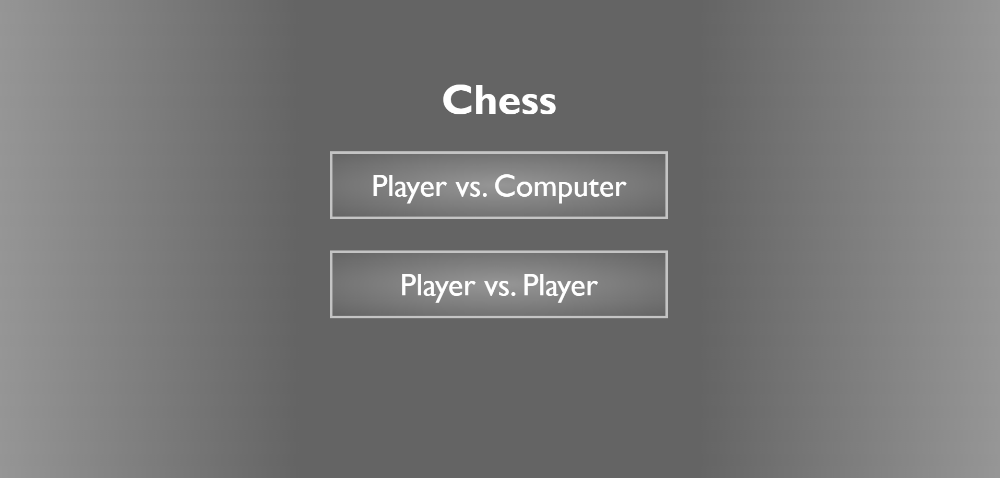
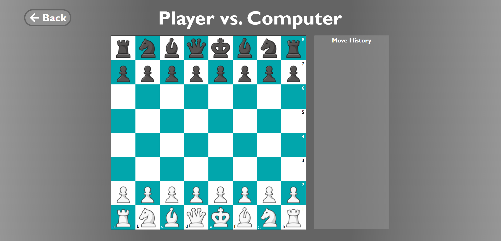
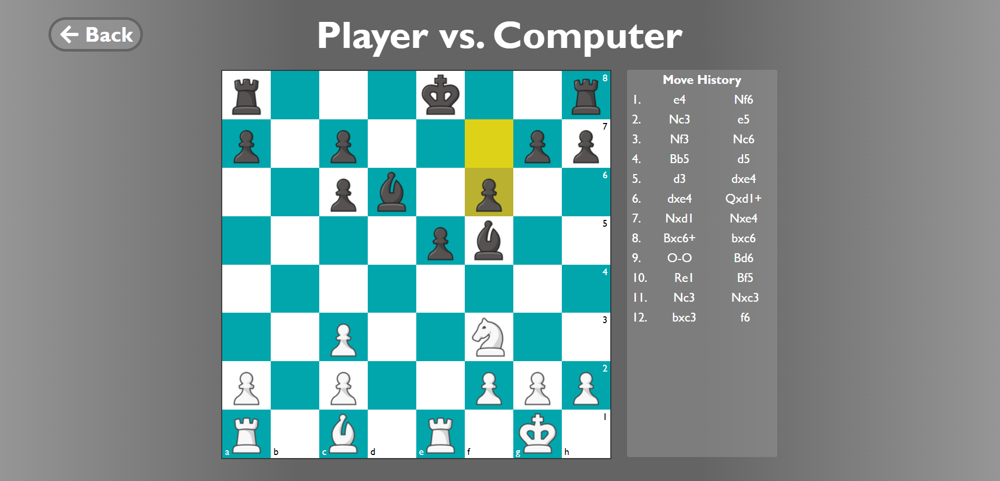

# Chess Web Application

I created a chess website using ReactJS and typescript. You can play
two-player (on one computer), or play against the computer. Some screenshots of
the application are below. The interactive website is
hosted [here](http://aniketg.me:4000/).

